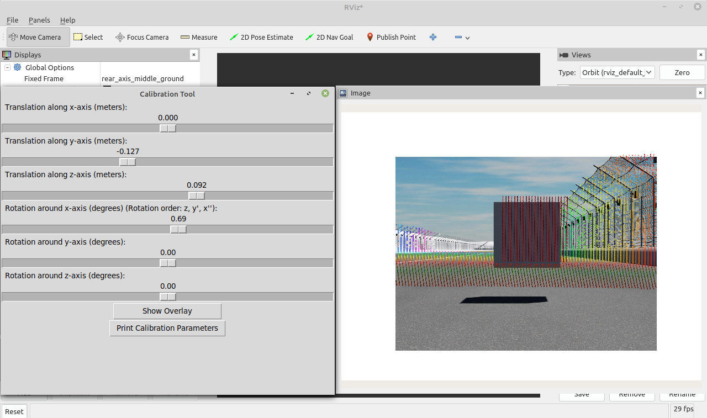
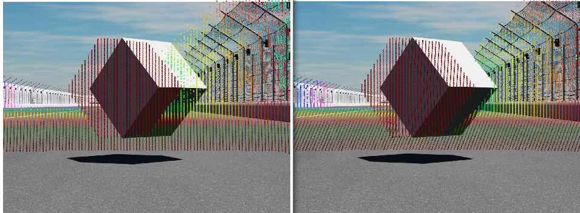

# Tool to calibrate the 6 DOF between LiDAR and camera using ROS2 and RVIZ.

Chris: 
To use this tool, 
1) install requirements.txt (in a conda environment or not, Python version 3.8 strictly
1.1) pip install -r requirements.txt
2) python3 main.py

Using this tool you can do the calibration between a camera and a LiDAR-sensor. The tool receives the camera image and point cloud from nodes publishing them. Based on the initial calibration parameters the LiDAR points are then projected to the image and an overlay is published and can be shown in RVIZ. Using a GUI, the user can adjust the 6 DOF and thereby create the optimal overlay between LiDAR points and the image. Based on that the calibration matrix is calculated, returned to the terminal and also written to a .txt file. 

The tool can either be executed on a system fulfilling the following prerequisites or by building an image from the dockerfile. Both ways are described in detail below.

## Prerequisites 
The code has been developed on **Linux Mint Cinnamon 19.3** in combination with **ROS2 Dashing** and **python 3.6.9**.
Furthermore, the software has also been tested on **Ubuntu 18.04** in combination with **ROS2 Dashing** and **python 3.6.9**.

## If fulfilling the prerequisites above follow these steps to be able to use the tool:

1. **Download code from this repository and save to desired folder.**

2. **Creating a virtual environment:**
* Creation of a virtual environment in the folder the repository was saved to: `python3 -m venv ~/path_to_tool/venv`
* Activating the virtual environment: `source ~/path_to_venv/venv/bin/activate`

3. **Install necessary python 3 packages from the file *requirements.txt:***
* Enter the following commands in the shell where venv is sourced.
* `cd ~/path_to_tool`
* Installing necessary packages: `pip install -r requirements.txt` (If not working try `pip3 install -r requirements.txt`)
* If a package cannot be found, execute: `pip install --upgrade pip` and try again. (If not working try `pip3 install --upgrade pip`)

4. **Install further necessary packages**
* Run the following commands: 
* `sudo apt-get update`
* `sudo apt-get install ros-ros_distro-cv-bridge` (Replace ros_distro with desired ros2 version)

5. **Adjusting intrinsic parameters:**
* Open *params.py* file and adjust the parameters according to your setup as described below: 
* In case of simulation data: 
set the parameter *sim_data* to "yes", set the horizontal and vertical FOV (*horizontal_FOV_cam*, *vertical_FOV_cam*) from the viewing frustum to the desired values (in degrees). 
* In case of camera data: 
set the parameter *sim_data* to "no", set the horizontal and vertical FOV (*horizontal_FOV_cam*, *vertical_FOV_cam*) from the camera (in degrees) to the desired values, enter the sensor size in meters (*width_sensorsize*, *height_sensorsize*), enter focal length in meters (*focal_length*).
* In both cases: enter the initial calibration (*translation*, *rotation*), enter the resolution of the camera / simulation images (*width_pixels*, *height_pixels*). The parameter *overlay_publish_timestep* determines how often a overlay is published. Set it to a value  your computer can calculate the overlay in (powerful computer: ~5 sec, not powerful computer: ~15 sec). This time step must be longer than the time step the calibration tool receives the image and point cloud in. Furthermore, adapt the parameters *sub_topic_pcd* and *sub_topic_image* to the name of the topics the image and pcd files are published under.  

6. **Running the calibration tool:**
* Before you start the calibration tool, make sure the ROS2 nodes which are publishing the camera image and point cloud are running. This can be done by opening two new shells and running the image publisher node as well as the pcd publisher node in them. Make sure to source ROS2 before(`source /opt/ros/ros_distro/setup.bash`).
* Go to the shell where the venv is running.
* Make sure ROS2 is sourced. 
* Go to directory where *main.py* file is stored: `cd ~/path_to_tool`.
* Launch the *main.py* file `python3 main.py`. Now the GUI shows up.
* Main.py subscribes to the published point clouds (default topic: */verlodyne_points*) and the published images (default topic: */front*).

7. **Overlay visualization in RVIZ2:**
* Open another shell, source ROS2 and run RVIZ: `rviz2`
* RVIZ2 shows up, click the *add* button and add the image topic under which the calibration tool publishes the overlay (default topic: */front_PCD_overlay*).

## If your system is not fulfilling the prerequisites mentioned above, follow these steps, to run the tool in a container.
To do so, you need Linux with any version of ROS2 and Docker installed.

### Instructions to start tool with docker on linux:
1. **Download code from this repository and save it to the desired folder.**

2. **Adjusting intrinsic parameters:**
* Open *params.py* file and adjust the parameters according to your setup as described below: 
* In case of simulation data: 
set the parameter *sim_data* to "yes", set the horizontal and vertical FOV (*horizontal_FOV_cam*, *vertical_FOV_cam*) from the viewing frustum to the desired values (in degrees). 
* In case of camera data: 
set the parameter *sim_data* to "no", set the horizontal and vertical FOV (*horizontal_FOV_cam*, *vertical_FOV_cam*) from the camera (in degrees) to the desired values, enter the sensor size in meters (*width_sensorsize*, *height_sensorsize*), enter focal length in meters (*focal_length*).
* In both cases: enter the initial calibration (*translation*, *rotation*), enter the resolution of the camera / simulation images (*width_pixels*, *height_pixels*). The parameter *overlay_publish_timestep* determines how often a overlay is published. Set it to a value  your computer can calculate the overlay in (powerful computer: ~5 sec, not powerful computer: ~15 sec). This time step must be longer than the time step the calibration tool receives the image and point cloud in. Furthermore, adapt the parameters *sub_topic_pcd* and *sub_topic_image* to the name of the topics the image and pcd files are published under. 

3. **Building Container**
* Open new shell
* Go to directory with downloaded code: `cd ~/path_to_tool`
* Run: `sudo docker build -t calibrate .`
* Run: `xauth list`. This command returns something like: *indyac-MacBookPro/unix:0  MIT-MAGIC-COOKIE-1  5e4562c30cecea2d161bd3cb2d25824b*. This output is needed to be able to run a GUI in a container --> copy it. 
* Run: `sudo docker run -ti --net=host -e DISPLAY -v /tmp/.X11-unix calibrate bash`
* Insert the output from *xauth list* after *add*: `xauth add `. It should look like: `xauth add indyac-MacBookPro/unix:0  MIT-MAGIC-COOKIE-1  5e4562c30cecea2d161bd3cb2d25824b`.
This will return the error: *xauth:  file /root/.Xauthority does not exist*. It can be ignored.
 
4. **Start calibration tool**
* Before you start the calibration tool, make sure the ROS2 nodes which are publishing the camera image and point cloud are running. This can be done by opening two new shells and running the image publisher node as well as the pcd publisher node in them.  
* Finally run `python3 main.py` in the shell where the container was created. 
* The GUI shows up.
* Main.py now subscribes to the published pointcloud (default topic: */verlodyne_points*) and the published images (default topic: */front*).

5. **Overlay visualization in RVIZ2:**
* Open another shell, source ROS2 and run RVIZ: `rviz2`
* RVIZ2 shows up, click the *add* button and add the image topic under which the calibration tool publishes the overlay (default topic: */front_PCD_overlay*).

## Calibration Process

**Creating calibration matrix:**
If you want to adjust the camera LiDAR calibration go to the GUI that just showed up. 
With the upper 3 sliders you can manually adjust the translation and with the lower 3 sliders you can adjust the rotations between LiDAR and camera.
After you moved the sliders to the desired position press the button *Show Overlay* at the GUI. A couple of seconds later the new overlay is shown in RVIZ. Repeat this process until the overlay is clean. After that press the button *Print Calibration Parameters* at the GUI. This will print out the initial calibrations (defined in the params.py file in *translation* and *rotation*), the slider values and the resulting calibration matrix to the terminal. The matrix has the format 4x4. The upper left 3x3 matrix is the rotation matrix and the 4th column is the translation in the format x,y,z,1. Furthermore, these values are written to a file called *calibrations.txt*. The first time you press this button this file will be created, after that new calibrations are appended at the end of the file. If the tool is started in the venv without docker, the calibrations.txt file can be found at the same location as the code from the tool. If the tool is started via docker on linux, the calibrations.txt file can be found at `/var/lib/docker`. 

**Best practice for the calibration process:**
The best results are achieved if you place some kind of calibration object in the FOV of camera and LiDAR. The tests of the tool have been done with a 1x1x1 meter cube. To achieve good results it is recommended to use some kind of 2D or 3D polygon with about the size of the cube. Having 1 meter side length has the advantage, that the magnitude of the offset can be seen quite easily. The tests have been done using a 3D object, which can also be twisted. Nevertheless, a 2D Object should not reduce the calibration accuracy.
If you are using a single cube, a distance of 10 to 20 meters from the sensors is remommended. This is due to have enough points on the cube but to also see the impact of rotation at the same time. To be able to do the calibration even more precisely, another cube can be used. The first one can now be located closer to the sensors and the second one should be located approximately 40 to 60 meters in front of the car. The second cube is especially helpful to improve the rotational calibration, as rotations can be better seen on targets in a larger distance. 

**The difference between rotation and translation**

The left picture shows a rotation of 2 degrees around z, while the right picture shows a translation in y of 0.3 m. Rotation makes all points move by a visible amount, while due to perspective transformation the translations of points which are close to the camera is easier to localize than the one from points far away. 

## Troubleshooting
* The following error message shows up: 
    *No image or point cloud has been received. Make sure to run the image and pcd publisher before starting the main.py file and check for correct topic names.The overlay publisher has been stopped.*
    Try / check the following points:
    - Make sure the topic names match between the publisher nodes and the tool. This can be checked by opening a new shell, sourcing ROS2 and running: `rqt_graph`
    - Make sure the timestep the camera image and the point cloud are published in is smaller or equal to the timestep the overlay is published in by the tool (this can be adjusted by the parameter *overlay_publish_timestep* in the *params.py* file)
    - Stop the calibration tool and the nodes publishing the camera image and the point cloud. Start the publisher nodes, wait a couple of seconds and start the calibration tool again. 
    - Check if the ROS2 message types of the published point cloud and camera image are *Image* and *Pointcloud2*
